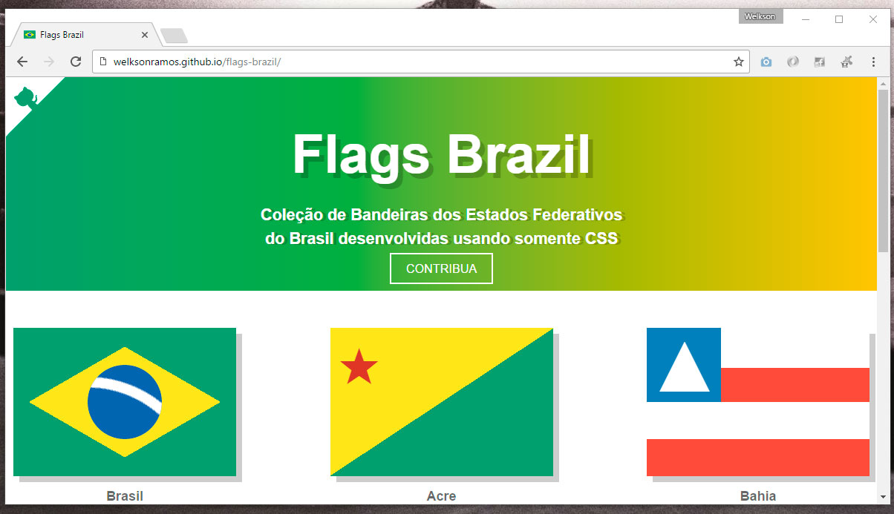

# [Flags Brazil](http://welksonramos.github.io/flags-brazil/)
> Bandeiras dos Estados Federativos do Brasil feitas somente com CSS



## Features
* Nada de Grunt/Gulp, somente npm scripts
* :after, :before, border, linear-gradient - CSS :+1:
* ~Somente 2 tags html (divs)~
* [Stylus](http://stylus-lang.com/)
* [Flat UI Colors](https://flatuicolors.com/)

## Tasks
```
$ npm run build:css  - Compila os arquivos .styl
$ npm run server     - Inicia o servidor estático e assiste os arquivos
$ npm run watch:css  - Assiste as mudanças nos arquivos e prepara para compilar
$ npm run dev        - Compila os arquivos e inicia o servidor estático
```
## Fix
* Upgrade parallelshell to version 3.0.2 to fix bug (Obrigado @gustavogf)

## Contribua
Gostaria de contribuir com o projeto? [Siga estas recomendações](CONTRIBUTING.md) :smile:

## License
[MIT License](LICENSE) &copy; 2016 Welkson Ramos
